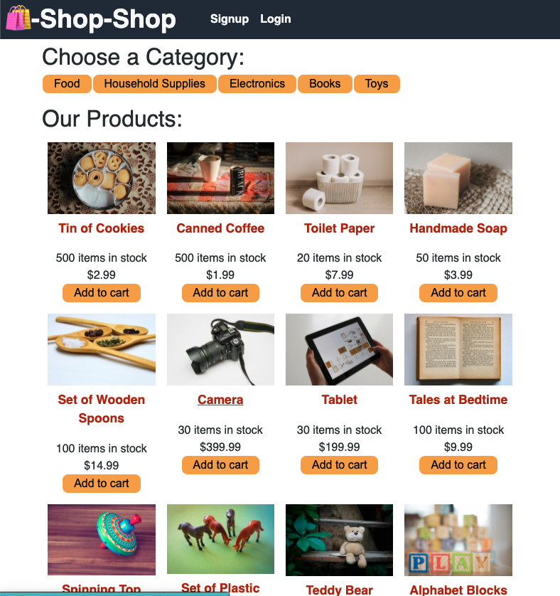

# shop-shop

"Actions" define the types of events that can be emitted to update state. State can only be updated if it's a predefined action

"Reducers" The actual functionality that carries out the emitted action to update state.

 

Docs for Use Reducer Hook: https://reactjs.org/docs/hooks-reference.html#usereducer

Docs for Context API: https://reactjs.org/docs/context.html
 

Docs for Use Effect Hook: https://reactjs.org/docs/hooks-effect.html#tip-optimizing-performance-by-skipping-effects 

